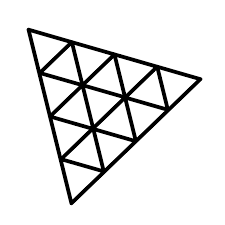

# 🕙 Cube Galaxy

Speedcubing is a competitive sport that involves solving a variety of combination puzzles, the most well-known of which is the 3x3x3 puzzle (also known as the Rubik's cube), as quickly as possible.
This **timer** helps speedcubers to tracks their solves and vizualise their **stats**.

URL : https://cube-galaxy.vercel.app/


## 🛠 Stack

[](https://nextjs.org/docs)[](https://react.dev/learn)[](https://tailwindcss.com/docs/installation)[](https://threejs.org/)[](https://www.typescriptlang.org/fr/docs/)

## 👨‍💻 Installation

```bash
git clone https://github.com/mariusSty/cube-galaxy.git
cd cube-galaxy
npm install
```

## 🚀 Getting start

```bash
npm run dev
```

Open [http://localhost:3000](http://localhost:3000) with your browser to see the result.
